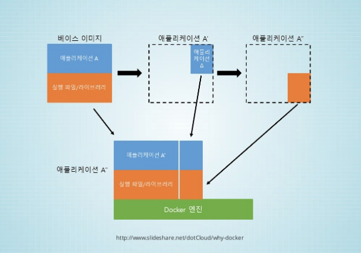

# DOCKER

#### docker를 서비스에 접목시키기.

 문스코딩 - 2017.01.08 

---

Docker란 무엇인가 ?

##### 01. 기본 서버 구축 방식
- OS 설치
- 웹 서버 설치 및 설정
- DB 설치 및 설정
- 소스 복사
- 사람이 일일이 설정

##### 02. Immutable Infrastructure (변하지 않는 인프라)
- 호스트 OS와 서비스 운영 환경 분리
- 한 번 설정한 운영 환경은 변경하지 않음
- 서비스 운영 환경을 통째로 교체

##### 03. Virtual Machine 과 Docker의 차이는 ?

#####  04. Linux Container

각각의 컨테이너 마다 독자적인 Linux OS처럼 사용할 수 있음

**Docker = cgroups , namespaces ... + Docker Hub + alpha**

##### 05. Docker 이미지와 컨테이너

docker 이미지 :: 실행 파일, 라이브러리, 소스 등을 묶은 이미지 파일 // # ex. os 실행 파일

docker 컨테이너 :: 이미지를 실행한 상태 // # ex. os 프로세스

---

**Created by SuperMoon**

**출처 : [SuperMoon's Git Blog](https://github.com/jm921106)**

**참조 : [링크1](https://www.slideshare.net/pyrasis/docker-docker-38286477)**

Copyright (c) 2017 Copyright Holder All Rights Reserved.
