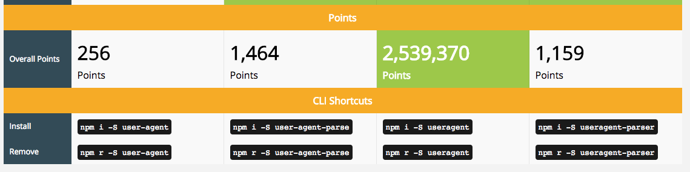

# NPM 저장소
## user agent 파싱하기

<div class="pull-right"> 문스코딩 - 2018.02.dd </div>

---

<!-- @import "[TOC]" {cmd="toc" depthFrom=1 depthTo=6 orderedList=false} -->
<!-- code_chunk_output -->

* [NPM 저장소](#npm-저장소)
	* [user agent 파싱하기](#user-agent-파싱하기)
		* [01. req.header['user-agent']](#01-reqheaderuser-agent)
		* [02. npm install useragent](#02-npm-install-useragent)
		* [03. 결과](#03-결과)
		* [04. 다양한 결과 얻기](#04-다양한-결과-얻기)

<!-- /code_chunk_output -->

**용어정리**
```

```

### 01. req.header['user-agent']

req.header['user-agent']는 유저 client의 사용환경을 가지고 있는 객체입니다.
하지만 각각의 client 사용환경값마다 너무나 다른 값들을 가지고 있습니다.
그렇기 때문에 해당 객체를 알맞게 파싱해줘야 합니다.

직접 만들 수 도 있지만, 너무 번거롭죠.

그래서 useragent라는 npm을 추천합니다.

### 02. npm install useragent

useragent는 가장 많이 쓰는 useragent parsing npm입니다.



```
    npm install useragent
    npm install useragent --save
```

### 03. 결과

```js
var useragent = require('useragent');
var agent = useragent.parse(ua);
console.log(agent);
/*
Agent {
  family: 'Safari',
  major: '11',
  minor: '0',
  patch: '3',
  source: 'Mozilla/5.0 (Macintosh; Intel Mac OS X 10_13_3) AppleWebKit/604.5.6 (KHTML, like Gecko) Version/11.0.3 Safari/604.5.6'
}
*/
```

### 04. 다양한 결과 얻기


---

**Created by SuperMoon**

**출처 : [SuperMoon's Git Blog](https://github.com/jm921106)**

[링크1 :: npm - useragent ](https://www.npmjs.com/package/useragent)

[링크2 :: ]()

Copyright (c) 2017 Copyright Holder All Rights Reserved.
