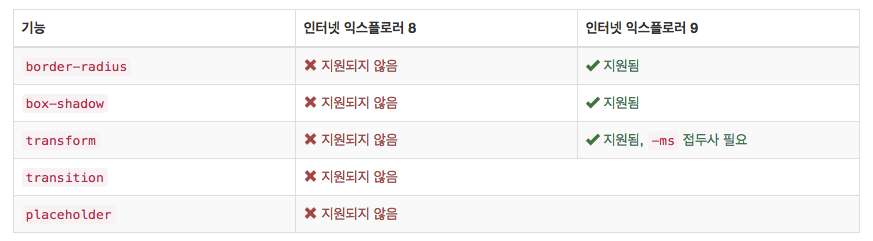

# BOOTSTRAP3 - 배워봅시다 !

#### BootStrap3를 처음부터 배워봅시다.

<div class="pull-right"> 문스코딩 - 2018.02.01 </div>

---

**용어정리**
```

```

#### 01. BootStrap 이란 무엇인가요

부트스트랩은 트위터에서 제공하는 Web Front 프레임워크입니다.
부트스트랩은 세계에서 가장 많이 쓰는 프레임워크로써 개발자끼리 코드를 이해하기에 쉽다는 장점이 있습니다.
하지만 모든 프레임워크의 문제점으로 지속적인 디자인 수정에 맞추기가 어렵다는 단점도 있어,
일부 개발자는 프로토타입제작할때는 유용하나 언젠가는 때어 내야할 계륵같은 존재라고 말하기도 합니다.
그리고 이번 부트스크랩 정리는 버전 3를 기준으로 합니다.
상위에는 버전 4가 있어 하위 호환성을 고려하지 않을 시에는 버전 4를 사용하는 것을 추천합니다.
그럼 이 부트스크랩을 배워봅시다.

#### 02. BootStap3 사용 방법

**CDN**

```html
<!-- 합쳐지고 최소화된 최신 CSS -->
<link rel="stylesheet" href="https://maxcdn.bootstrapcdn.com/bootstrap/3.3.2/css/bootstrap.min.css">

<!-- 부가적인 테마 -->
<link rel="stylesheet" href="https://maxcdn.bootstrapcdn.com/bootstrap/3.3.2/css/bootstrap-theme.min.css">

<!-- 합쳐지고 최소화된 최신 자바스크립트 -->
<script src="https://maxcdn.bootstrapcdn.com/bootstrap/3.3.2/js/bootstrap.min.js"></script>
```

**bower**

```
$ bower install bootstrap

```

**npm**

```
$ npm install bootstrap
```

부트스트랩의 pakage.json는 다음 항목들을 비롯해 일부 추가 메타 정보를 가지고 있습니다.
- less :: 부트스크랩의 메인 Less 소스 파일의 경로
- style :: 부트스트랩의 최소화 되지 않은 CSS의 경로, 기본 설정으로 프리 컴파일만 되어 있습니다.

#### 03. Less / Sass

부트스트랩은 CSS prefixes 를 다루기 위해 Autoprefixer를 사용합니다.
만약 부트스트랩의 Less/Sass 소스를 부트스크랩의 Gruntfile을 사용하지 않고 컴파일할 것이라면,
Autoprefixer를 빌드 프로세승 통합하는 것이 필요합니다.
만약 프리컴파일된 부트스트랩을 사용하거나 부트스크랩의 Gruntfile을 사용한다면, 이에 대해 걱정할 필요는 없습니다.


#### 04. 호환성

부트스트랩은 인터넷 익스플러러 8, 9까지 지원하지만 몇 가지 주의 해야할 요소가 있습니다.




---

**Created by SuperMoon**

**출처 : [SuperMoon's Git Blog](https://github.com/jm921106)**

[링크1 :: ]()

[링크2 :: ]()

Copyright (c) 2017 Copyright Holder All Rights Reserved.
