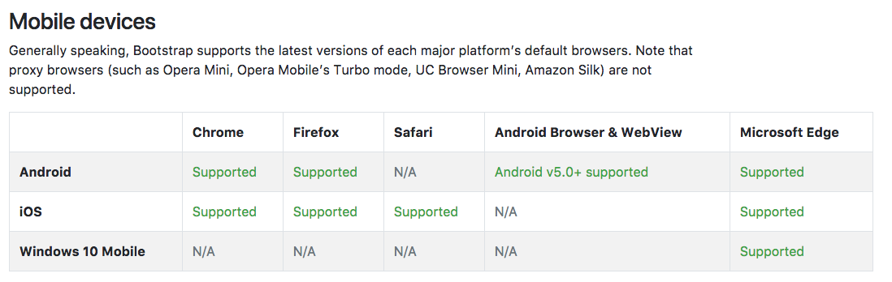
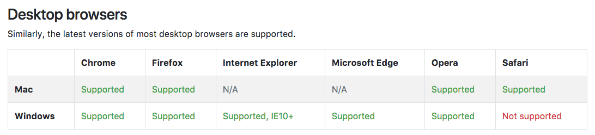

# BOOTSTRAP 4 - 시작하세요 !

#### bootstrap 4 로 빠른 페이지 프로토타입 만들기.

<div class="pull-right"> 문스코딩 - 20178.01.17 </div>

---

**용어정리**
```
    BOOTSTRAP ::
```

#### 01. BootStrap 이란 ?

부트스트랩은 트위터에서 제공하는 Web Front 프레임워크입니다.
부트스트랩은 세계에서 가장 많이 쓰는 프레임워크로써 개발자끼리 코드를 이해하기에 쉽다는 장점이 있습니다.
하지만 모든 프레임워크의 문제점으로 지속적인 디자인 수정에 맞추기가 어렵다는 단점도 있어,
일부 개발자는 프로토타입제작할때는 유용하나 언젠가는 때어 내야할 계륵같은 존재라고 말하기도 합니다.
그리고 이번 부트스크랩 정리는 버전 4를 기준으로 하며, 하위 버전 지원이 어렵다는 점도 있으니 꼭 아래 호환성을 참고해야합니다.
그럼 이 부트스크랩을 배워봅시다.

#### 02. BootStrap CDN

CDN이란, 따로 파일을 다운 받지 않고 의존성 패키지를 인터넷으로 받아오는 것을 말합니다.
부트스트랩은 CDN 링크를 제공합니다.

**css 링크**

```html
<link rel="stylesheet" href="https://maxcdn.bootstrapcdn.com/bootstrap/4.0.0/css/bootstrap.min.css" integrity="sha384-Gn5384xqQ1aoWXA+058RXPxPg6fy4IWvTNh0E263XmFcJlSAwiGgFAW/dAiS6JXm" crossorigin="anonymous">
```

**js 링크**

```html
<script src="https://code.jquery.com/jquery-3.2.1.slim.min.js" integrity="sha384-KJ3o2DKtIkvYIK3UENzmM7KCkRr/rE9/Qpg6aAZGJwFDMVNA/GpGFF93hXpG5KkN" crossorigin="anonymous"></script>
<script src="https://cdnjs.cloudflare.com/ajax/libs/popper.js/1.12.9/umd/popper.min.js" integrity="sha384-ApNbgh9B+Y1QKtv3Rn7W3mgPxhU9K/ScQsAP7hUibX39j7fakFPskvXusvfa0b4Q" crossorigin="anonymous"></script>
<script src="https://maxcdn.bootstrapcdn.com/bootstrap/4.0.0/js/bootstrap.min.js" integrity="sha384-JZR6Spejh4U02d8jOt6vLEHfe/JQGiRRSQQxSfFWpi1MquVdAyjUar5+76PVCmYl" crossorigin="anonymous"></script>
```

> 빠른 개발을 위해서 부트스크랩에서 제공하는 CDN을 사용하는 것도 좋지만 안정적인 서비스를 제공하기 위해서
> 자신의 서버에 부트스트랩을 다운 받아 사용하는 것을 추천합니다.

**추가사항**

항상 <head> 태그 안에 viewport 메타태그를 같이 추가해 줘야 합니다.
다음 추가 사항은 다양한 미디어 퀴리에서 안정적인 픽셀 사이즈를 보장합니다.

```html
<meta name="viewport" content="width=device-width, initial-scale=1, shrink-to-fit=no">
```

#### 03. 기본 형식

```html
<!doctype html>
<html lang="en">
  <head>
    <!-- Required meta tags -->
    <meta charset="utf-8">
    <meta name="viewport" content="width=device-width, initial-scale=1, shrink-to-fit=no">

    <!-- Bootstrap CSS -->
    <link rel="stylesheet" href="https://maxcdn.bootstrapcdn.com/bootstrap/4.0.0/css/bootstrap.min.css" integrity="sha384-Gn5384xqQ1aoWXA+058RXPxPg6fy4IWvTNh0E263XmFcJlSAwiGgFAW/dAiS6JXm" crossorigin="anonymous">

    <title>Hello, world!</title>
  </head>
  <body>
    <h1>Hello, world!</h1>

    <!-- Optional JavaScript -->
    <!-- jQuery first, then Popper.js, then Bootstrap JS -->
    <script src="https://code.jquery.com/jquery-3.2.1.slim.min.js" integrity="sha384-KJ3o2DKtIkvYIK3UENzmM7KCkRr/rE9/Qpg6aAZGJwFDMVNA/GpGFF93hXpG5KkN" crossorigin="anonymous"></script>
    <script src="https://cdnjs.cloudflare.com/ajax/libs/popper.js/1.12.9/umd/popper.min.js" integrity="sha384-ApNbgh9B+Y1QKtv3Rn7W3mgPxhU9K/ScQsAP7hUibX39j7fakFPskvXusvfa0b4Q" crossorigin="anonymous"></script>
    <script src="https://maxcdn.bootstrapcdn.com/bootstrap/4.0.0/js/bootstrap.min.js" integrity="sha384-JZR6Spejh4U02d8jOt6vLEHfe/JQGiRRSQQxSfFWpi1MquVdAyjUar5+76PVCmYl" crossorigin="anonymous"></script>
  </body>
</html>
```

#### 04. 호환성



모바일 브라우저에서 가장 주의해야할 점은 Android 버전 5 부터 Bootstrap4를 지원하는 것을 확인할 수 있습니다.
하위버전인 킷캣, 젤리빈을 지원하지 않음을 주의해햐 합니다.





---

**Created by SuperMoon**

**출처 : [SuperMoon's Git Blog](https://github.com/jm921106)**

**[링크1 :: bootstrap - content](https://getbootstrap.com/docs/4.0/getting-started/contents/)**

Copyright (c) 2017 Copyright Holder All Rights Reserved.
