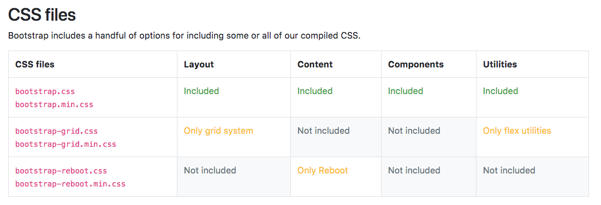
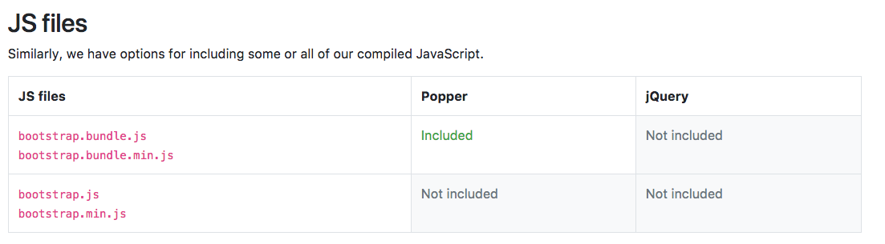

# BOOTSTRAP4 - 시작하세요 !

#### 부제목을 작성해 주세요.

<div class="pull-right"> 문스코딩 - 2018.01.dd </div>

---

**용어정리**
```

```

#### 01. 부트스트랩 구조

```dir
bootstrap/
├── css/
│   ├── bootstrap.css
│   ├── bootstrap.css.map
│   ├── bootstrap.min.css
│   ├── bootstrap.min.css.map
│   ├── bootstrap-grid.css
│   ├── bootstrap-grid.css.map
│   ├── bootstrap-grid.min.css
│   ├── bootstrap-grid.min.css.map
│   ├── bootstrap-reboot.css
│   ├── bootstrap-reboot.css.map
│   ├── bootstrap-reboot.min.css
│   └── bootstrap-reboot.min.css.map
└── js/
    ├── bootstrap.bundle.js
    ├── bootstrap.bundle.min.js
    ├── bootstrap.js
    └── bootstrap.min.js
```

부트스트랩의 구조는 다음과 같습니다.

#### 02. css 파일



bootstrap.min.css는 부트스크랩의 모든 기능을 사용할 수 있습니다.
bootstrap-grid.min.css는 부트스크랩의 Grid 기능만 가볍게 사용할 수 있습니다.
bootstrap-reboot.min.css는 부트스트랩의 Content 기능만 사용할 수 있습니다.

> 상황에 따라 맞는 css를 import 해야하지만 웹페이지마다 추구하는 디자인이 다르기 때문에 grid 정도만 사용하는 것을 추천합니다.

#### 03. js 파일



#### 04. 전체 프로젝트 구조

```dir
bootstrap/
├── dist/
│   ├── css/
│   └── js/
├── docs/
│   └── examples/
├── js/
└── scss/
```


---

**Created by SuperMoon**

**출처 : [SuperMoon's Git Blog](https://github.com/jm921106)**

[링크1 :: ]()

[링크2 :: ]()


Copyright (c) 2017 Copyright Holder All Rights Reserved.
