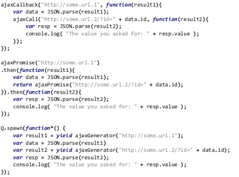

# JACASCRIPT ES6 기본 문법 정리

#### Javascrtipt es6 기본 문법 정리 index.

<div class="pull-right"> 문스코딩 - 20178.01.dd </div>

---

**용어정리**
```
 ES6 == ES2015 :: 기본 자바스크립트에서 개선된 문법(Syntax)를 가지고 업데이트된 새로운 자바스크립트
 ECMAScript :: js 프로그래밍 언어를 정의하는 국제 표준의 이름
 test suite :: 테스트 모듈
 Iteration :: 페이지 참조
 Iterable :: 페이지 참조
 Iterator (반복기) :: 페이지 참조
 Generator (생성기) :: 페이지 참조
 function* :: 페이지 참조
 expr ::
 strict mode ::
 Nesting ::
 GC (garbage collection) :: 사용하지 않는 메모리들을 자동으로 거둬들이는 기능을 말함
```

**ES6 지원범위 확인하기**
https://kangax.github.io/compat-table/es6/

**2015년 / 6월 ES6 == ES2015 대규모 수정**
- interoperability
    - 기존 스펙과의 하위 호환성
    - 기존의 웹 페이지 및 JS 코드
    - 스펙과 맞지 않는 코드도 많음
    - 알고리즘까지 포함하느 매우 자세한 스펙
    - 매우 많은 test suite
- Modularlity
- Better Abstraction Capabil
    - Better Functional programming support
    - Better OO support
- Expressiveness and Clarity
    - 예전의 "가능한 실행 오류 없이 진행" 정책은 사라지고 있음
- Betteer Compliation Target
    - 현재 JS는 플랫폼 측면에서 독보적 위치
    - 다른 프로그래밍 언어를 JS로 컴파일 가능

> ES6는 해외에서 이미 표준으로 사용중

**ES6의 새로운 기능**
- Arrow Functions
- Classes
- Enhanced Object Literals
- Template Literals
- Destructing (Pattern Matching)
- Default , Rest , Spread Parameters
- Let , Const (data type)
- Iterator , For - Of
- Generators
- Promises
- Modelus
- Map, Set , WeakMap , WeakSet
- Symbols
- Math, Number, String, Array, Object APIs
- Proxy, Reflect
- 기타

**01. Arrow Functions (람다식)**

```js

// # ES5
func1 = evens.map(function(v) { return v + 1; });
func2 = evens.map(function(v) { return {even : v, odd : v + 1}});
func3 = evens.map(function(v, i) { return v + 1; });

// # ES6
func1 = evens.map(v => { return v + 1; })
func2 = evens.map(v => ({ even : v , odd : v+1}));
func3 = evnes.map((v, i) => v + 1);
```

- Function 표현 대체
- 오른쪽이 expr인 경우 해당 값 리턴
- Block 인 경우 return문 필요
- 바깥쪽의 this를 그대로 사용 (오!)

**02. Class**

- 기존 Prototype 기반 super
- Constructor 메소드
- Base Class 접근 가능
- Static 메소드
- Getter / Setter
- Class Expression 기능

###### 사용예시

```js
class HelloWorld extends Parent {
    constructor () {

    }

    get itemLength() {
        return this.item.length;
    }

    set itemLength(item) {
        this.item.length = item.length
    }

    method1() {

    }

    static method2() {

    }
}
```

**03. 향상된 Object Literals**

- __proto__ 로 prototype chain 을 직접 지정
- Property 이름과 같은 변수 이면 생략
- 함수 쉽게 기술
- Super 접근
- Property 이름을 동적으로 계산 가능
- Class 문법과 비슷

###### 사용예시


```js

```

**04. Template Literals**
- Multi line
- String interpolation
    - 문자열 중간에 expr 삽입
- tag를 통해 추가적인 처리 가능
    - 태그는 파싱된 template string을 인자로 받고 임의의 값을 리턴할 수 있는 함수
    - 자동으로 파싱이 된다는 점에서 단순 함수 호출과 차이

###### 사용예시

```js

```

**05. Destructing (Pattern Matching)**

- Array, Object의 요소를 쉽게 분해
- Nesting 된 것도 분해 가능
- Property 이름과 변수 이름이 같을 때 간략한 표현
- 인자에서도 가능
- 없는 요소의 경우 undefined
- Default 값 지정 가능
- 다른 매치시 에러
    - 단, Iterable은 array로 분해 가능

###### 사용예시


```js

```

**06. Default + Rest + Spread Parameters**
- 호출시 계산되는 Default 인자
    - 왼쪽에서부터 계산된 expr 가능
- 나머지 인자들 배열
    - 기존의 arguments 대체
    - 인자가 없으면 빈 배열
- 배열을 풀어서 인자로 넘기기

###### 사용예시

```js
function f(x, y=12) {
    return x + y;
}
f(3) == 15

function f (x, ...y) {
    // y is an Array
    return x * y.length;
}
f(3, 'hello', true) == 6

function f (x, y, z) {
    return x + y + z;
})
f(...[1,2,3]) == 6
```

**07. LET + CONTS**

- let + block 스코프 변수 선언
    - var 대체
    - global 객체에 들어가지 않음
    - for 문 init 위치에 선언한 경우 iteration 마다 새로 생김
    - forward reference 금지

- const - 상수 선언

###### 사용예시

```js

```

**08. Iterators + For ~ Of**

- for-in  객체 property 순회
- for-of iterable 순회
    - Symbol.iterator 메소드가 있으면 iterable
- Symbol.iterator 메소드
    - iterator를 반환
- Iterator
    - next() 메소드가 다음 값 정보를 반환
    - 필요할 때만 다음 값이 계산
    - 직접 Iterator protocol을 구현해야 하는 경우 없음 (-> Generator이용)

###### 사용예시

```js
// # 피보나치 수열 예제
let fibonacci = {
    [Symbol.iterator]() {
        let pre = 0, cur = 1;
        return {
            next() {
                [pre, cur] = [cur, pre+ cur];
                return { done : false, value : cur};
            }
        };
    }
}

for (let n of fibonacci) {
    if(n > 1000)
        break;
    console.log(n)
}
```

**09. Generator**

- 실행중 멈췄다 다시 실행 할 수 있는 특별한 함수
    - function 키워드 사용
    - iterator 를 리턴
    - next() 호출하면 실행
    - yield 문에서 멈추고 앞의 next()가 리턴

```js
let fibonacci = {
    *[Symbol.iterator] () {
        let pre =0, cur=1;
        for(;;) {
            [pre, cur] = [cur, pre+cur];
            yield cur;
        }
    }
}

for(let n of fibonacci) {
    if(n > 1000)
        break;
    console.log(n);
}

// ========================================

function* range(start, end, step) {
    while (start < end) {
        yield start;
        start += step;
    }
}

for(let i of range (0, 10, 2)) {
    console.log(i); // 0, 2, 4, 6, 8
}

```

**10. Promises**

나중에 (asynchronously) 값이 채워지는 것
- 이미 광범위 하게 사용 중 ( Q, bludbird, library)
- 3가지 상태 (Pending, Fulfilled, Rejected)
- then() 등의 메소드로 중첩된 callback을 좀더 flat 하게 표현 가능

###### 사용예시

```js
// # callback style
function func1 (arg1, arg2, arg3, onDone) {
    setTimeout (function() {
        onDone(arg1 + " " + arg2 + "!");
    }, arg3)
}
func1("arg1", "arg2", 100, function(msg) {
    func1(msg, "arg2", 200, function(msg) {
        console.log('300ms ' + msg);
    })
});

// # promise style
function func2 (arg1, arg2, arg3) {
    return new Promise((resolve, reject) => {
            setTimeout(() => resolve('${arg1} ${arg2} !'), arg3)
    });
}
func2("arg1", "arg2", 100)
.then((msg) => {
    func2(msg, "arg2", 200)
})
.then((msg) => {
    console.log('300ms ' + msg);
})
```

**11. Promises + Generators**
- 다중 callback 해결
- async operation을 sync 스타일로 작성 가능

###### 사용예시



**12. Modules**
- 모듈은 파일 단위
- export 키워드로 내보낼 toplevel 요소 선언
- import 키워드로 가져올 요소 선언
    - 모듈 통째로 import 가능
    - 이름을 변경하여 import 가능
- CommonJS, AMD 모듈과 공존 가능
- 완전 Static
    - 의존 관계를 최초 로딩 시점에 모두 파악
    - 쉽게 bundling 가능
- 무조껀 strict mode로 해석
- Toplevel 요소는 module-local
- 항상 비동기 로딩
- HTML에서 로딩

```js
// lib/math.js
export function sum (x, y) {return x + y};
export var pi = 3.141592;

// someApp.js
import * as math from "lib/math";
console.log("2 pi = " + math.sum(math.pi, math.pi));

// otherApp.js
import { sum, pi } from "lib/math";
console.log("2 pi = " + sum(pi, pi));
```

**13. MAP + SET + WEAK_MAP + WEAK_SET**

- 유용한 collection 라이브러리
- Map : Any Value -> any value
    - Object : string -< value
- Set : Any Value
- Key/Value Equality
    - === 사용 / 단, NaN == NaN
- WeakMap, WeakSet
    - 다른 reference가 없으면 자동 GC됨
        - Cache에 유용
    - 제한된 동작
        - WeakMap의 key와 WeakSet의 value는 객체만 가능 (num X)
        - WeakMap :: .has(), .get(), .set(), .delete()
        - WeakSet :: .has(), .add(), .delete()
        - Iterable 아님


**ES6 호환 관련 (-> ES5화)**
ES6 코드는 Babel을 이용해서 ES5 코드로 변환하는 것이 가능
ES5의 경우 지원 브라우저의 폭이 더 넓기 때문에 Babel을 이용해서 브라우저 호환성을 확보할 수도 있음

---

**Created by SuperMoon**

**출처 : [SuperMoon's Git Blog](https://github.com/jm921106)**

**참조 : [링크1](https://cimfalab.github.io/deepscan/2016/07/ecmascript-6)**

Copyright (c) 2017 Copyright Holder All Rights Reserved.
